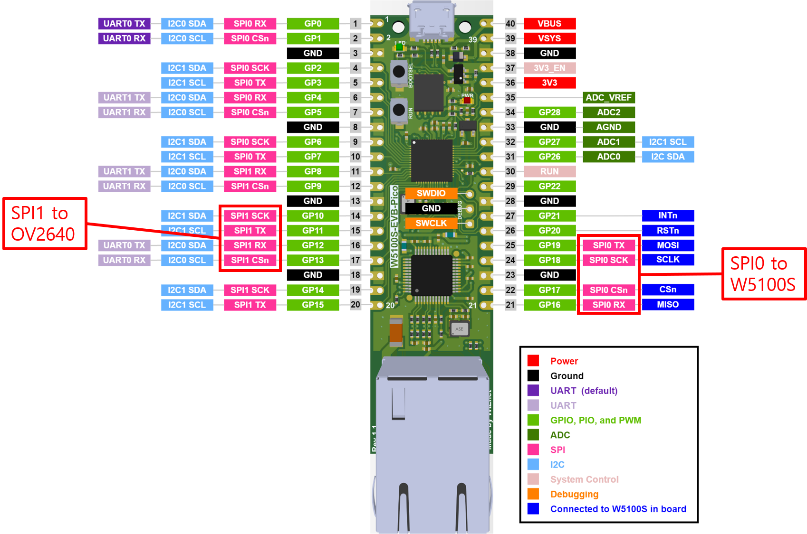

# W5100S-ArduCAM-Arduino-Examples
 
This GitHub repository serves as a comprehensive resource for utilizing Arducam camera modules with the Raspberry Pi RP2040 microcontroller and the W5100S Ethernet controller. It features two distinct examples, each showcasing the seamless integration of Arducam hardware with these platforms. The repository demonstrates the implementation of a web server and a security system using a Telegram bot, making it a valuable reference for IoT and embedded systems enthusiasts.

Repository Contents:

* Web Server Example:
    This section provides a detailed guide on setting up a web server using the Arducam camera module, RP2040, and W5100S Ethernet controller. It includes step-by-step instructions, code samples, and wiring diagrams to enable users to create a functional web server that can stream camera feed or capture images remotely.

* Security System with Telegram Bot:
    In this section, you'll find comprehensive documentation and code examples for building a security system integrated with a Telegram bot. This system utilizes Arducam for capturing images or video feeds upon detecting motion or security events. It then leverages the RP2040 microcontroller and W5100S Ethernet controller to send notifications and images to a Telegram bot, enabling remote monitoring and alerts.

## Hardware used in the projects:

* W5100S-EVB-Pico
* OV2640 camera

## Connection diagram




## Important note

1. By default, [Arducam library](https://github.com/ArduCAM/Arduino) uses SPI0 to connect with the camera. Since in our setup SPI0 is used to communicate with W5100S, the library was modified to use SPI1 instead.

The code modifications are as following:

* memorysaver.h: added RASPBERRY_PI_PICO to defined variables

```cpp
#define RASPBERRY_PI_PICO
```

* ArduCAM.h: added function defines for new RASPBERRY_PI_PICO
```cpp
#if defined (RASPBERRY_PI_PICO)
	#define regtype volatile uint32_t
	#define regsize uint32_t
	#define cbi(reg, bitmask) digitalWrite(bitmask, LOW)
  	#define sbi(reg, bitmask) digitalWrite(bitmask, HIGH)
#endif
```

* ArduCAM/ArduCAM.cpp: updated write/read related functions to run with SPI1
```cpp
#if defined ( RASPBERRY_PI_PICO )
#define SPI_SETTINGS SPISettings(4000000, MSBFIRST, SPI_MODE0)
#endif
...

ArduCAM::ArduCAM(byte model ,int CS)
{
	#if defined (RASPBERRY_PI)
		if(CS>=0)
		{
			B_CS = CS;
		}
	#else
		#if (defined(ESP8266)||defined(ESP32)||defined(TEENSYDUINO) ||defined(NRF52840_XXAA) ||defined(RASPBERRY_PI_PICO))
		  B_CS = CS;
		#else
		  P_CS  = portOutputRegister(digitalPinToPort(CS));
		  B_CS  = digitalPinToBitMask(CS);
		#endif
	#endif

...


void ArduCAM::set_fifo_burst()
{
	#if defined (RASPBERRY_PI)
	transfer(BURST_FIFO_READ);
	#elif defined(RASPBERRY_PI_PICO)
	//SPI1.beginTransaction(SPI_SETTINGS);
	SPI1.transfer(BURST_FIFO_READ);
	//SPI1.endTransaction();	
	#else
    SPI.transfer(BURST_FIFO_READ);
  	#endif
		
}

...


uint8_t ArduCAM::bus_write(int address,int value)
{	
	cbi(P_CS, B_CS);
	#if defined (RASPBERRY_PI)
		arducam_spi_write(address | 0x80, value);
	#elif defined (RASPBERRY_PI_PICO)
		//SPI1.beginTransaction(SPI_SETTINGS);
		SPI1.transfer(address);
		SPI1.transfer(value);
		//SPI1.endTransaction();
	#else
		SPI.transfer(address);
		SPI.transfer(value);
	#endif
	sbi(P_CS, B_CS);
	return 1;
}

uint8_t ArduCAM:: bus_read(int address)
{
	uint8_t value;
	cbi(P_CS, B_CS);
	#if defined (RASPBERRY_PI)
		value = arducam_spi_read(address & 0x7F);
		sbi(P_CS, B_CS);
		return value;
	#elif defined (RASPBERRY_PI_PICO)
		//SPI1.beginTransaction(SPI_SETTINGS);
		SPI1.transfer(address);
		value = SPI1.transfer(0x00);
		  // take the SS pin high to de-select the chip:
		//SPI1.endTransaction();	
		sbi(P_CS, B_CS);
		return value;
	#else
		#if (defined(ESP8266) || defined(__arm__) ||defined(TEENSYDUINO))
		#if defined(OV5642_MINI_5MP)
		  SPI.transfer(address);
		  value = SPI.transfer(0x00);
		  // correction for bit rotation from readback
		  value = (byte)(value >> 1) | (value << 7);
		  // take the SS pin high to de-select the chip:
		  sbi(P_CS, B_CS);
		  return value;
		#else
		  SPI.transfer(address);
		  value = SPI.transfer(0x00);
		  // take the SS pin high to de-select the chip:
		  sbi(P_CS, B_CS);
		  return value;
		#endif
		#else
		  SPI.transfer(address);
		  value = SPI.transfer(0x00);
		  // take the SS pin high to de-select the chip:
		  sbi(P_CS, B_CS);
		  return value;
		#endif
#endif
}

```

2. In Pico related repositories, the SPI settings are changed to run at 4MHz, the same settings were tested when making changes to the library. However, during actual tests there was no difference if the settings were applied during SPI transaction.

## How to use

Please refer to readme file in corresponding folder to find detail guide.