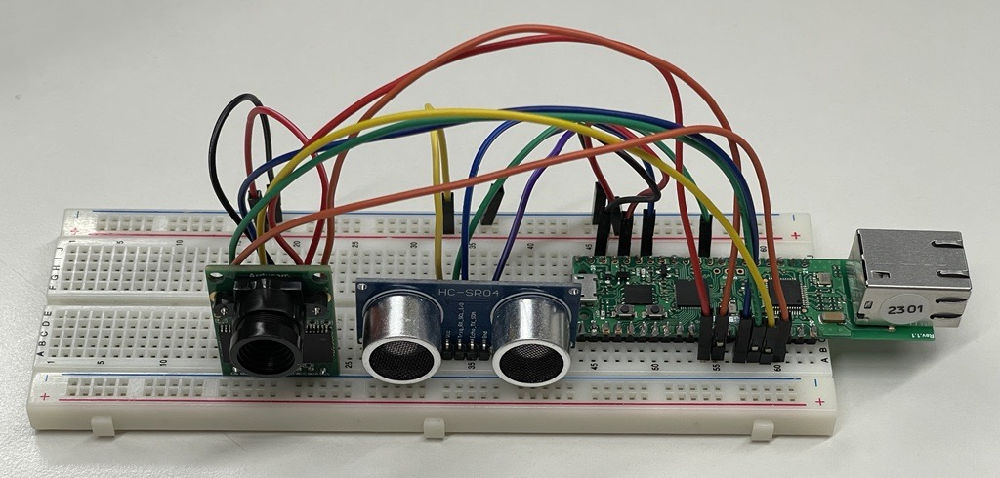

# Surveillance System example
 
This example aims to demonstrate how to implement simple security surveillance system. The camera can be controlled via Telegram Bot.
In addition to hardware stated in main folder, the HC-SR04 ultrasound sensor is added to provide automode function to the system.



## Libraries used in the project

1. [Arducam library](): please pay attention to important note in main readme file.
2. [WebServer](https://github.com/khoih-prog/EthernetWebServer/tree/master) by Khoi Hoang
3. [AsyncTelegram2](https://github.com/cotestatnt/AsyncTelegram2/tree/master) by Tolentino Cotesta

## Project summary

The "Ethernet" example from AsyncTelegram library was used as a basis for this project.
"Capture" button was added to the keyboard to make a single shot.
"Automode ON/OFF" buttons were added to enable/disable the ultrasound sensor.

When sensor is enabled, if there is any object within 1 meter (short distance was selected for test purposes), then camera automatically captures and sends image to the Telegram bot.

## Code explanation

### Ethernet and Telegram bot related code:

For test purposes the board is assigned with static IP.

Telegram bot setup is done main setup() function:

**Setup Function:**
   ```cpp
   - The `setup()` function is the initialization routine.
   - It initializes serial communication, I2C, SPI, camera, and Ethernet.
   - It sets up the Telegram bot, reply keyboard, and inline keyboard.
   - A welcome message is sent to the Telegram bot.
   - `alarmStatusEE` is set to `false` initially.
   ```

### Camera related functions

1. **test_capture() Function:**
   ```cpp
   - This function clears the FIFO (First In, First Out) flag of the camera and initiates a capture.
   ```

2. **camCapture() Function:**
   ```cpp
   - This function captures an image from the camera and sends it as an HTTP response with the appropriate content type and length.
   - It reads the image data from the camera's FIFO buffer and sends it to the client.
   ```

3. **i2c_init(), spi_init(), and camera_init() Functions:**
    ```cpp
    - These functions initialize the I2C and SPI communication interfaces and set up the camera module.
    - They perform various checks to ensure that the communication with the camera module is established correctly.
    ```

### Main Loop

```cpp
- The `loop()` function runs repeatedly.
- It handles incoming Telegram messages and manages the reply keyboard.
- It checks if the ultrasonic distance sensor detects an intruder and sends a capture requesto the Telegram bot.
```

**Ultrasonic Distance Sensor:**
   ```cpp
   - The code monitors the ultrasonic distance sensor to detect intruders.
   - It calculates the distance and, if an intruder is detected, sends a message to the Telegram bot and captures an image.
   - The ultrasonic sensor is controlled by the `triggerPort` and `echoPort` pins.
   ```

## Demonstration

Before running, do not forget to input Bot token and your ID!

When connected, the board will attempt connection to Telegram.
Once successful, it will send the keyboard settings and will wait for commands.

The full demo video can be checked in this [Youtube video](https://youtu.be/JPQ0hpEAPEw)