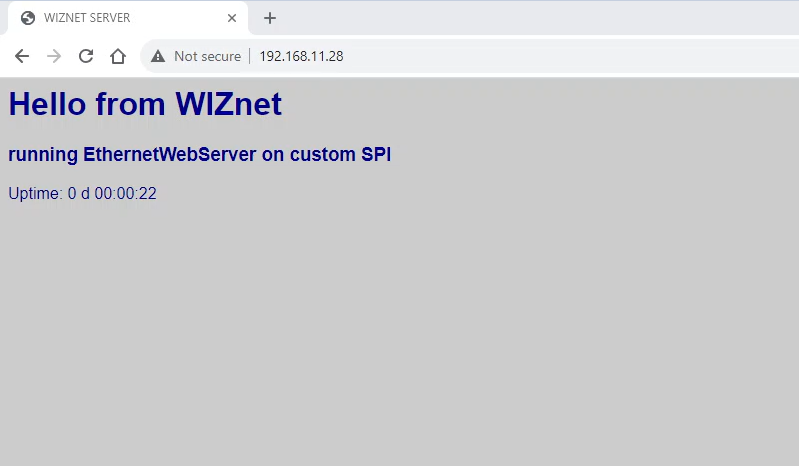

# Webserver example
 
This example aims to demonstrate how to implement simple webserver and transmit image from OV2640 camera to webpage using WIZnet W5100S.

## Libraries used in the project

1. [Arducam library](): please pay attention to important note in main readme file.
2. [WebServer](https://github.com/khoih-prog/EthernetWebServer/tree/master) by Khoi Hoang

## Project summary

Webserver wil be serving 3 pages:
1. Root page - shows simple text and server up time
2. Capture page - when user visits the page, the camera takes single shot and transmits to the page
3. Stream page - upon user visit, the camera sends frames in real-time.

## Code explanation

### Ethernet and webserver related code:

For test purposes webserver will be running on static IP which is coded in defines.h file.

1. **handleRoot() Function:**
   ```cpp
   - This function generates an HTML response with information about the server's uptime and serves it when the root URL ("/") is accessed.
   ```

2. **handleNotFound() Function:**
   ```cpp
   - This function responds with information about the requested URI, HTTP method, and arguments when a page is not found (404 Not Found).
   - If a query parameter "ql" is provided in the request, it changes the JPEG quality setting of the camera module.
   ```

3. **serverCapture() Function:**
   ```cpp
   - This function initiates a camera capture, measures the time taken for the capture, and then calls `camCapture()` to send the captured image to the client.
   ```

4. **serverStream() Function:**
   ```cpp
   - This function sets up a multipart response for streaming video frames.
   - It continuously captures frames from the camera and sends them as parts of a multipart response, creating a live video stream.
   ```

### Camera related functions

1. **test_capture() Function:**
   ```cpp
   - This function clears the FIFO (First In, First Out) flag of the camera and initiates a capture.
   ```

2. **camCapture() Function:**
   ```cpp
   - This function captures an image from the camera and sends it as an HTTP response with the appropriate content type and length.
   - It reads the image data from the camera's FIFO buffer and sends it to the client.
   ```

3. **read_fifo_burst() Function:**
    ```cpp
    - This function reads image data from the camera module's FIFO buffer in burst mode.
    - It processes the image data and prints it to the serial port. This function is not directly used for serving HTTP requests.
    ```

4. **i2c_init(), spi_init(), and camera_init() Functions:**
    ```cpp
    - These functions initialize the I2C and SPI communication interfaces and set up the camera module.
    - They perform various checks to ensure that the communication with the camera module is established correctly.
    ```

### Setup & Loop

1. **setup() Function:**
    ```cpp
    - This function is the setup routine that runs once when the Arduino starts.
    - It initializes serial communication, I2C, SPI, and the camera module.
    - It configures the Ethernet connection and sets up various routes for handling HTTP requests.
    ```

2. **loop() Function:**
    ```cpp
    - The `loop()` function runs continuously, and its main purpose is to handle incoming HTTP requests through the `server.handleClient()` method.
    ```

## Demonstration

When connected to network, the board will run Webserver on designated IP.



The capture and stream page demo can be checked below and in [Youtube video](https://youtu.be/oNN7dklpJ64).


